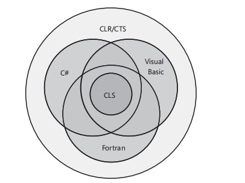

# .NET 体系结构

 .NET 实现包括 .NET Framework .NET Core Mono.

 .NET 的所有实现都有一个名为 `.NET Standard` 的通用 API 规范

## 编译

.NET 编译过程是将源文件编译为中间语言(`IL`)和元数据(`metadata`)组成的托管模块的过程.

编译过程是通过编译器(例如 MS最新的开源编译器`Roslyn`)的完成的.

```shell
C# Files -> Managed Mudole
VB Files -> Managed Mudole
Other Code Files -> Managed Mudole
```

一个托管模块包含以下内容:

* PE32 or PE32+ header(Windows 下的 .NET Framework才会有,用于启动clr等)
* CLR header
* Metadata
* IL Code

IL Code 是硬件无关的,CLR负责执行这些IL Code.

.NET 并不是直接运行托管模块的,而是需要将托管模块以及各种资源合并成程序集再运行.

这是编译(或者称为BUILD)的第二个步骤.

形成的程序集就可以被CLR加载运行了.

### Native Code

另外需要注意的是,编译阶段不止可以生成IL语言,甚至可以直接生成机器码,无需通过CLR运行.

## 运行

CLR(Common Language Runtime,公共语言运行时)负责加载与执行程序集.

CLR 在不同的.NET平台上有不同的实现.但是作用都是加载与运行程序集.

## BCL/FCL

`.NET Standard` 中定义了一系列 `API`,例如 Network, File, System, Thread等操作.

.NET Core .NET Framework 负责实现这些 `API`.

这样编写不同平台代码时就可以直接调用这些 API 而无需关心平台如何实现了,只需要直到不同的平台一定实现就可以了.

上面这些就是所谓的 `Basic Class Libaray`

而 `Framework Class Library` 其实是特指.NET Framework 实现的基础类库, 是 `BCL` 的超集,除了 BCL 的功能,还提供 `WCF` `WPF`等功能.

这些并不是(目前) `.NET Standard` 规范.

## CTS

`CLR` 的核心是类型.

微软定义了 Common Type System 并将其规范化为 `Common Language Infrastructure`

CTS 定义:

* Interface Class Struct
* 类型成员(Members) 例如 Field Metohd
* 访问级别 `Private` `Family` `Family and assembly` `Assembly ``Family or assembly` 以及 `Public`
* 类型继承派生关系

通过上述规范保证实现CLR时,CLR面对的都是遵循相同规范的类型系统.

## CLS

CLR 允许 不同语言.

但是如何保证C# 编写的代码可以被VB调用呢?

例如 C# 可以使用 `yield` `dynamic` `async` `await`等关键字.但是VB没有如何调用呢?

这就是 CLR/CTS的子集 Common Language Specification 所做的事情.

CLS 并不会将这些作为其标准,因此 C# 编译器需要按照CLS 将 async await 编译成符合 CLS规范的IL语言,这样就可以被 VB调用了.


