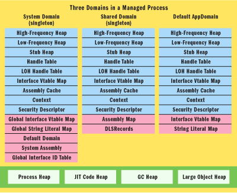
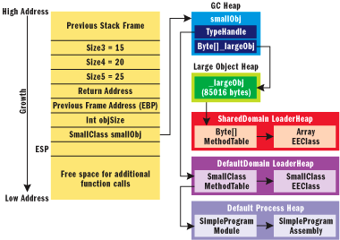
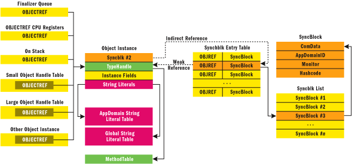
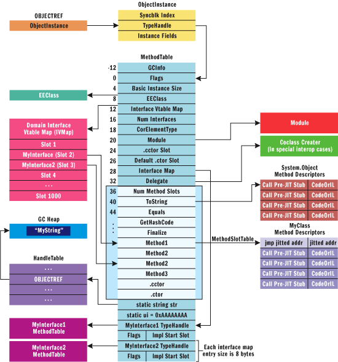
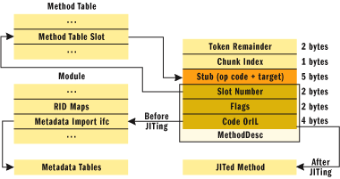

# CLR

* [CLR](#clr)
  * [Metadata](#metadata)
  * [互操作性](#%E4%BA%92%E6%93%8D%E4%BD%9C%E6%80%A7)
  * [Runtime](#runtime)
    * [Managed Code](#managed-code)
    * [Managed Memory](#managed-memory)
    * [AppDomain](#appdomain)
      * [CLR启动与寄宿](#clr%E5%90%AF%E5%8A%A8%E4%B8%8E%E5%AF%84%E5%AE%BF)
      * [AppDomains](#appdomains)
      * [跨AppDomain访问](#%E8%B7%A8appdomain%E8%AE%BF%E9%97%AE)
    * [Reflect](#reflect)
    * [Exception](#exception)

## Metadata  

* PE头
* 表流: TypeDef TypeRef等
* String
* US
* Blob
* Guid

```cs
.entrypoint  
.maxstack  3  
.locals ([0] int32 ValueOne,  
         [1] int32 ValueTwo,  
         [2] int32 V_2,  
         [3] int32 V_3)  
IL_0000:  ldc.i4.s   10  
IL_0002:  stloc.0  
IL_0003:  ldc.i4.s   20  
IL_0005:  stloc.1  
IL_0006:  ldstr      "The Value is: {0}"  
IL_000b:  ldloc.0  
IL_000c:  ldloc.1  
IL_000d:  call int32 ConsoleApplication.MyApp::Add(int32,int32) /* 06000003 */  
```

调用 Add 方法 (/* 06000003 */) 的元数据标记,该标记参考 MethodDef 表的第三行

## 互操作性

* P/Invoke

```cs
// Import user32.dll (containing the function we need) and define
// the method corresponding to the native function.
[DllImport("user32.dll")]
public static extern int MessageBox(IntPtr hWnd, String text, String caption, int options);


protected override void RunCore() {
    // Invoke the function as a regular managed method.
    MessageBox(IntPtr.Zero, "Command-line message box", "Attention!", 0);
}
```

* type-marshalling

`MarshalAs`

```cs
public struct CBool {
    [MarshalAs(UnmanagedType.U1)]
    public bool b;
}
```

## Runtime

### Managed Code

MSIL ---JIT--> Native Code

### Managed Memory

Stack

Heap

* Loader Heap: contains CLR structures and the type system , every Domain has a different loader heap
  * High Frequency Heap: statics, MethodTables, FieldDescs, interface map
  * Low Frequency Heap: EEClass, ClassLoader and lookup tables
  * Stub Heap: stubs for CAS, COM wrappers, PInvoke

GC Heap is shared among app-domains and GC will work only on that

* GC Heap: user allocated heap memory private to the app
  * Small Object Heap : Gen 0 1 2
  * Large Object Heap: memory allocations that require more than 85k bytes
* JIT Code Heap: memory allocated by mscoreee (Execution Engine) and the JIT compiler for managed code
* Process/Base Heap: interop/unmanaged allocations, native memory, etc

CLR Heap 结构:



一个对象的信息实际分布在多个Heap 中,GCHeap Method Table :



一个对象的信息实际分布在多个Heap 中, SyncBlockEntryTable 以及 SyncBlock 不属于托管堆,属于CLR 内部非托管堆



托管堆上的对象都有类型对象指针,同步块索引

GetType 其实利用了类型对象指针

Method Table 结构 :





* GC

回收策略 : 可达图 ,标记对象不可达, 从根对象开始遍历如果能访问到则标记为可达,最后不可达的选择清除.

清除后会进行 compact,整理内存碎片

分代回收. Gen 0 ,Gen 1 ,Gen 2 通常情况下仅对 Gen 0 进行标记清除.

如果 Gen 1 or Gen 2 引用了 Gen 0, JIT代码生成时会添加 write barrier 写入 对象会将对应的 card table 中设置标志位. 垃圾回收 Gen 0 时,会检查被设置了 标志位的 老代对象是否被修改并且是否引用了 Gen 0. 被引用Gen 0 也被看做可达对象存活.

Gen 0 1 2 的内存预算都会根据实际情况进行调节 : 回收的多就会减少,回收的少就会增加,这有一个启发式算法进行调节.

* Finalize

  * 实现终接器的对象在被创建时会放在 `终结列表`中.
  * 垃圾回收标记阶段,被判断为垃圾的对象会从`终结列表`移除并添加到到 `freachable` 列表等待被终结
  * 添加到 `freachable` 中的对象被视为标记为可达的,因此被重新标记为可达,不会从托管堆中被移除,而是会被提升到下一代.
  * 标记完成后,GC线程清理并 compact 托管堆.
  * 同时CLR终结线程(优先级高)调用 `freachable` 列表中的对象的 Finalize 方法,终结对象,并从 `freachable` 中移除(现在是不可达的了)
  * 下一代GC时,这些可终结对象作为不可达对象被清除.

[Finalize](../src/CLR/GCRunner.cs)

* Dispose
  
  手动提前释放资源.
  
  1. 降低GC开销.
  2. `StreamWriter` `FileStream` 如果被动等待 GC终结,可能导致 `StreamWriter` 来不及向 `FileStream` 中写入数据

[Dispose模式](../src/CLR/DisposeRunner.cs)

* GC API

GC 提供了很多 API 可以用于协助 监控以及干预GC

1. GC.AddMemoryPressure HandleCollector 如果存在大量非托管资源或者个数有限的资源可以让让GC更及时的执行 [Demo](../src/CLR/HandleCollectorRunner.cs)
2. RegisterForFullGCNotification 监控GC执行 [Demo](../src/CLR/GCNotificationRunner.cs)
3. ReRegisterForFinalize SuppressFinalize 终结队列 [Demo](../src/CLR/GCNotification.cs)
4. GCHandler fix WeekReference [Demo](../src/CLR/GCHandlerRunner.cs) WeakReference 实际是对 GCHandler 的封装

### AppDomain

#### CLR启动与寄宿

`nt -> mscoree(shim) -> clr -> managed code`

#### AppDomains

AppDomain 可以看做轻量的被CLR托管的进程.

SystemDomain

SharedDomain : mscorlib

DefaultDomain : 其他程序集包括 System.dll

隔离!!!

#### 跨AppDomain访问

[跨AppDomain访问](..\src\AppDomainSample\AppDomainRunner.cs)

* MarshalByRefObject (MarshalByRef,Proxy)
* Serializable (MarshalByValue)

### Reflect

程序集加载

1. 使用某个类型时,CLR 根据 Assembly PE头部定义的TypeRef和 AssemblyRef 查找引用了哪个 Assembly 自动加载文件(强弱命名)
2. 通过 Assembly.Load 加载

* 构造
  * System.Activator.CreateInstance / CreateInstanceFrom
  * System.AppDomain’s methods  CreateInstance, CreateInstanceAndUnwrap, CreateInstanceFrom, and CreateInstanceFromAndUnwrap.
  * System.Reflection.ConstructorInfo’s Invoke instance method
* System.Reflection.MemberInfo
  * System.TypeInfo : A nested type is a member
  * System.Reflection.FieldInfo
  * System.Reflection.MethodBase
    * System.Reflection.ContructorInfo
    * System.Reflection.MethodInfo
  * System.Reflection.PropertyInfo
  * System.Reflection.EventInfo

[Using Binding Handles](..\src\CLR\UsingBindingHandleRunner.cs)

### Exception

Contract