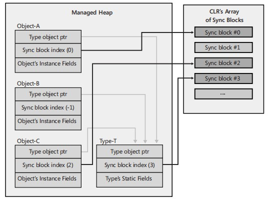

# 多线程与异步与并行

* [多线程与异步与并行](#%E5%A4%9A%E7%BA%BF%E7%A8%8B%E4%B8%8E%E5%BC%82%E6%AD%A5%E4%B8%8E%E5%B9%B6%E8%A1%8C)
  * [thread](#thread)
  * [synchronization](#synchronization)
    * [Volatile](#volatile)
    * [用户模式构造](#%E7%94%A8%E6%88%B7%E6%A8%A1%E5%BC%8F%E6%9E%84%E9%80%A0)
    * [内核模式构造](#%E5%86%85%E6%A0%B8%E6%A8%A1%E5%BC%8F%E6%9E%84%E9%80%A0)
    * [混合模式构造](#%E6%B7%B7%E5%90%88%E6%A8%A1%E5%BC%8F%E6%9E%84%E9%80%A0)
    * [Singleton](#singleton)
    * [More about Monitor](#more-about-monitor)
    * [异步模式构造](#%E5%BC%82%E6%AD%A5%E6%A8%A1%E5%BC%8F%E6%9E%84%E9%80%A0)
    * [线程安全集合](#%E7%BA%BF%E7%A8%8B%E5%AE%89%E5%85%A8%E9%9B%86%E5%90%88)
  * [async](#async)
    * [ThreadPool](#threadpool)
    * [任务](#%E4%BB%BB%E5%8A%A1)
    * [异步 I/O](#%E5%BC%82%E6%AD%A5-io)
  * [parallel](#parallel)

## thread

* CLR线程与OS线程:等同
* 线程优先级
* 前台/后台线程

`饥饿`,低优先级线程一直得不到调度.

`deadlock` 多个线程由于同步资源循环等待,导致都无法获取下一步执行需要的同步资源形成死锁, `deadlock`形成条件:

1. 互斥条件: 一个资源每次只能被一个进程使用.
2. 请求与保持条件: 一个进程因请求资源而阻塞时,对已获得的资源保持不放.
3. 不剥夺条件: 进程已获得的资源,在末使用完之前,不能强行剥夺.
4. 循环等待条件: 若干进程之间形成一种头尾相接的循环等待资源关系.

`livelock` 单个线程每次尝试获取同步资源时,同步资源都被抢占(但是并没有形成死锁条件),从而导致一直无法获取同步资源而导致线程一直自旋,形成活锁(`livelock`).活锁可以通过一个负责发放令牌的主持人(内核)调度线程避免.当主持人确定该线程可以获取同步资源时,调度该线程.

死锁浪费内存,活锁即浪费内存也浪费CPU.

## synchronization

线程同步问题

### Volatile

[Demo](../src/Thread/VolatileRunner.cs)
  
在一段代码中,如果重复只读的形式访问一个字段,JIT会对这个字段进行优化,只从RAM中读取一次然后放在寄存器中,之后访问都直接访问寄存器了,不会再访存.

并发场景下,如果另外一个线程写入了这个字段,上面代码段中将不会检测到变更.

因此出现了 volatile 关键字防止JIT对此进行优化.

但是因此也带来了一些问题:

  1. a = a + a ,如果 a 添加了 volatile 修饰,那么每次将会读取内存2次.
  2. out/ref/in 参数不支持 volatile

### 用户模式构造

* 用户模式构造 互锁/自旋
  * SpinWait() : 仅在超线程CPU上切换到另外一个线程,如果不存在超线程则执行nop. 这个是CPU级别的而不是OS级别的调度.  
  * Sleep(0) : 让出时间片等待调度.低优先级线程不会被调度到.
  * Yield() : 检查是否有等待调度的线程,如果有让出时间片.
  * Sleep(1) : 强制让出时间片,不可能被立刻调度到.
  但是考虑到性能问题,一直自旋可能对其他线程不公平,实际会使用混合构造:

[Demo](../src/Thread/SimpleSpinLock.cs)

* 原子操作 Interlocked

Interlocked 实际是do while...

[Demo](../src/Thread/InterlockedEverything.cs)

用户模式构造通过持续监测线程同步情况,如果当前线程没有获取同步资源,将一直自旋(可以理解为一直执行 nop 指令),内核线程调度系统检测不到用户模式构造的阻塞.

用户模式构造容易因为同步资源获取算法导致形成活锁,例如实现 SimpleSpinLock 时,增加了SpinOnce(n) 中 n的等待时间增长,实际最好增加随机等待时间,类似 `CSMA/CD` (载波监听多点接入/碰撞检测)

当然用户模式构造也会形成死锁(`deadlock`).

### 内核模式构造

内核模式构造会将线程同步调度权交给内核,如果线程同步资源可用,会主动调度当前线程,否则当前线程将一直处于等待状态.

如果因为某些情况将形成死锁(`deadlock`).

设计到内核调用,因此开销会比较大.

[Demo](../src/Thread/LockPerformanceRunner.cs)

```cs
Incrementing x: 33
Incrementing x in M: 69
Incrementing x in SpinLock: 224
Incrementing x in SimpleWaitLock: 11,035
```

但是有很多好处: 跨进程,避免活锁,调用更加灵活.

WaitHandle.Wait();

* EventWaitHandle
  * AutoResetEvent 自动Reset
  * ManualResetEvent 需要手动Reset

[Demo](../src/Thread/SimpleWaitLock.cs)

* Semaphore

信号量 > 0 ,不阻塞, 信号量 == 0 阻塞

Event 和 Semaphore 都属于信号量的范畴,但是底层Win32API却不一样 : CreateEventEx CreateSemaphoreEx

本质是内核维护的 `bool` 或 `int32` 的变量,当内核检测到值发生变化时,被WaitOne()阻塞的线程会被调度执行.

[Demo](../src/Thread/SimpleWaitLock2.cs)

* Mutex

互斥体更加复杂:

1. 申请/释放互斥体记录线程信息,ReleaseMutex 需要时 RequireMutex 的那个线程,否则抛异常
2. 持有Mutex 的线程因异常终止, 阻塞的线程也会受到异常
3. 一个线程Require相同的Mutex 会递归计数.Require 几次 就释放几次.当前线程 Reqiure 多次并不会被阻塞多次

[Demo](../src/Thread/SimpleMutex.cs)

### 混合模式构造

在进入内核模式构造之前,先尝试通过 Spin 的方式尝试自旋等待一段时间再进入内核模式构造.

[混合模式构造](../src/Thread/SimpleHybridLock.cs)

Fcl Hybrid Construct

* ManualResetEventSlim
* SemaphoreSlim
* Monitor

Monitor.Enter 与 Monitor.Exit

Enter 和 Exit 实际是修改同步块索引的方式实现锁的

同步块索引



Enter 时检查对象同步快索引指向的同步块是否被锁定,如果被锁定,则会Spin 然后再内核模式构造

Exit 时,会释放同步块索引,如果有线程在等待该锁,还需要通过通知该线程.

这部分实现位于 CLR [syncblk.cpp](https://github.com/dotnet/coreclr/blob/d3e39bc2f81e3dbf9e4b96347f62b49d8700336c/src/vm/syncblk.cpp#L1583) 中的 AwareLock中.

* ReaderWriterLockSlim : 读写锁
* CountdownEvent 底层使用了 ManualResetEventSlim 行为与 Semaphore相反
* Barrier : 线程完成一阶段后 斯奥用 SignalAndWait 挂起,等待所有线程都完成后,再进行下一阶段.

[Barrier](../src/Thread/BarrierRunner.cs)

### Singleton

[Singleton](../src/Thread/SingletonRunner.cs)

* Lazy
* LazyInitializer

[Lazy&LazyInitializer](../src/Thread/LazyRunner.cs)

### More about Monitor

Monitor.Wait 以及 Monitor.Pulse

[Monitor](../src/Thread/MonitorRunner.cs)

### 异步模式构造

当出现多线程需要同步时,常见的用法是使用上述锁,Event,信号量等方式,阻塞线程,等待资源可用.

这种模式会出现: 上下文切换,当锁释放,会有很多线程被激活并尝试获取锁,如果获取不到又会被挂起...

可以换中思路 : 如果锁得不到执行可以返回并执行其他工作,等到锁可用后恢复并访问锁资源.而不是简单的等待.

[AsyncLock Demo](../src/Thread/AsyncLockRunner.cs)

### 线程安全集合

* ConcurrentDictionary : 锁
* ConcurrentQueue : Interlocked
* ConcurrentStack : Interlocked
* ConcurrentBag : 多个 list ,每个线程一个

## async

通过线程/线程池系统调用,将需要执行的操作交给其他线程(也可以是其他进程甚至是内核)上执行(例如IO,密集计算等),当前线程继续执行其他操作.当操作执行完成,通过回调等方式通知主线程.上述操作称为异步.

### ThreadPool

[ThreadPool](../src/Thread/ThreadPoolRunner.cs)

### 任务

### 异步 I/O

## parallel

.Net Parallel 内部使用了 Task,对数据处理提供并行操作.