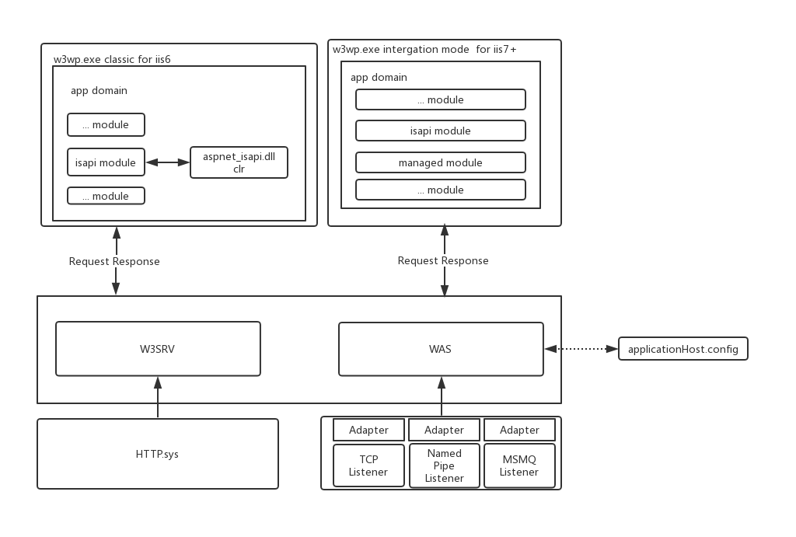
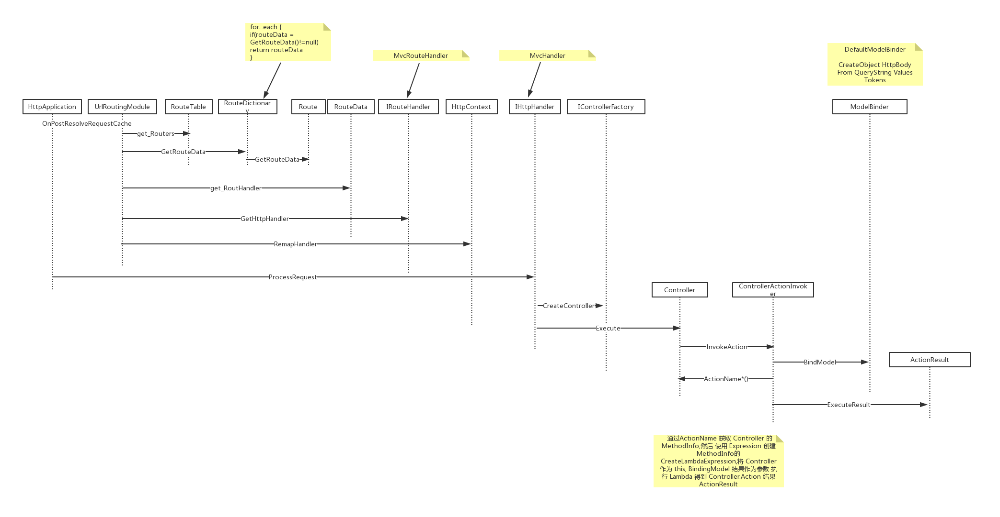

# ASP.NET

* [ASP.NET](#aspnet)
  * [Hosting](#hosting)
    * [IIS](#iis)
    * [HttpApplication](#httpapplication)
  * [ASP.NET MVC](#aspnet-mvc)
    * [ASP.NET MVC Overview](#aspnet-mvc-overview)
    * [Route](#route)
    * [Controller](#controller)
    * [Model](#model)
    * [Action](#action)
    * [ActionResult](#actionresult)
      * [ViewResult](#viewresult)
  * [ASP.NET WebForm](#aspnet-webform)
  * [Asp.Net WebApi](#aspnet-webapi)

## Hosting

非托管代码 (IIS) 和 托管代码(ASP.NET) 是如何打通的

### IIS

* IIS5 : inetinfo.exe(aspnet_isapi.dll) -> aspnet_wp.exe(clr)
* IIS6 : HTTP.sys -> svchost.exe(w3svc) -> w3wp.exe(aspnet_isapi.dll,clr), 改进:
  * HTTP.sys
  * 从单个 asp.net_wp.exe 改进为多个 w3wp.exe(应用池,可以加载不同版本clr)
  * inetinfo.exe 监听/处理 Request /管理应用程序被分到 HTTP.sys 和 w3mvc 中.inetinfo.exe只提供配置给w3svc.
* IIS7 : HTTP.sys -> svchost.exe(w3svc->was) -> w3wp.exe(clr),改进:
  * 抽象Protocol Listeners,was不仅可以处理HTTP.sys 接收到的 HTTP Request,还支持处理实现 Listener Adapter Interface的其他 Request ,例如 TCP,NamedPipe,MSMQ(WCF).
  * 抛弃 inetinfo.exe,从 applicationHost.config 读取配置
  * Integrated mode pipeline : 支持直接加载托管mudule,不需要再通过 isapi (ISAPI extensions) 方式处理 asp.net Http Request .
    * 托管模块 UrlRoutingModule 负责处理 asp.net Request .Integrated模式下, asp.net 不再是扩展,而是作为一等公民执行.IIS 执行模式也跟IIS 6有所不同.
    * 但依旧提供兼容iis6的Classic mode pipeline : 对于asp.net Request ,常见的静态文件模块(`StaticFileModule`)无法处理, `isapiModule` 接管这个 Request ,然后将 asp.net Request 交给aspnet_isapi.dll(ISAPI extensions)处理,后者通过托管环境处理.这种兼容处理还可以在asp.net 代码中大量的见到.

[Changes in Security Between IIS 6.0 and IIS 7 and Above](https://docs.microsoft.com/zh-cn/iis/get-started/whats-new-in-iis-7/changes-in-security-between-iis-60-and-iis-7-and-above#web-service-extension-restriction-list)

### HttpApplication

TODO: 待补充:

1. IIS 如何通过 ISAPIRuntime 和 PipelineRuntime 创建 Managed Application
2. Managed Application 的生命周期

HttpApplication 处理请求过程.

| Event                                              | Description                                |
| -------------------------------------------------- | ------------------------------------------ |
| BeginRequest                                       | 开始处理 Request                           |
| AuthenticateRequest,PostAuthenticateRequest        | 对 Request 进行身份验证                    |
| AuthorizeRequest,PostAuthorizeRequest              | 对 Request 授权                            |
| ResolveRequestCache,PostResolveRequestCache        | 允许根据缓存对 Request 直接 Response       |
| PostMapRequestHandler                              | 匹配 HttpHandler,用于处理 Request          |
| AcquireRequestState,PostAcquireRequestState        | 获取 Request 对应的状态,如SessionState     |
| PreRequestHandlerExecute,PostRequestHandlerExecute | 处理 Request                               |
| ReleaseRequestState,PostReleaseRequestState        | 释放 Request 对应的当前状态,如SessionState |
| UpdateRequestCache,PostUpdateRequestCache          | 处理 Request 得到的 Response 保存到缓存    |
| LogRequest,PostLogRequest                          | Request 进程日志记录                       |
| EndRequest                                         | 整个 Request 处理完成                      |

## ASP.NET MVC

### ASP.NET MVC Overview

ASP.NET MVC 如何处理一次 ASP.NET 请求的

### Route

* RouteTable
  * Routes
* RouteCollection
  * RouteExistingFiles : 如果存在物理文件匹配 Request URL,是否还对该 URL 实施路由,默认为 False.
  * Add() : add Route
  * Ignore() : ignore url
  * GetRouteData() : HttpContext -> RouteData,实际`foreach in this`调用Route 同名方法,用于获取 Handler 处理 Request
  * GetVirtualPath() : HttpContext + RouteCollection + values -> VirtualPathData,实际`foreach in this`调用Route 同名方法,用于Redirect等功能
* Route
  * DataTokens : DataTokens,自定义变量,生成 RouteData 时使用
  * Default : Default Values,Url 中变量默认值. 生成 RouteData时,(如果Url没有解析出变量情况下)使用
  * Constraints : Route 约束. 影响到是否匹配 Url.
* RouteData
  * Values  : Url 中解析出的变量
  * DataTokens : 自定义变量
  * RouteHandler : 路由Handler,用于获取 IHttpHandler
* RouteHandler : PageRouteHandler MvcRouteHandler
  * GetHttpHandler()
* IHttpHandler : 用于 ProcessRequest 处理请求,Page(asp.net) MvcHandler(asp.net mvc)
  * ProcessRequest()
* VirtualPathData : 用于URL的生成 , UrlHelper , HtmlHelper
* AreaRegistration : 划分区域

### Controller

* IController/IAsyncController
  * void Execute(RequestContext requestContext);
* ControllerBase
  * ViewBag : 对ViewData 的 dynamic 封装
  * ViewData
* Controller
* ControllerBuilder/IControllerFactory

DefaultControllerFactory 遍历通过BuildManager的静态方法GetReferencedAssemblies方法得到的编译Web应用所使用的程序集,通过反射得到所有实现了接口IController的类型,最后通过给定的Controller的名称和命名空间作为匹配条件在这个预先获取的类型列表中得到目标Controller的类型

### Model

### Action

### ActionResult

#### ViewResult

## ASP.NET WebForm

## Asp.Net WebApi